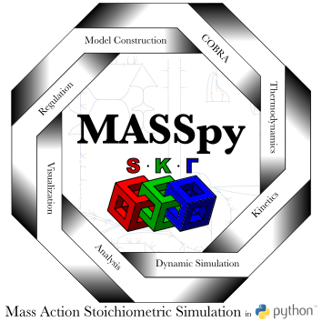

MASSpy: Modeling Dynamic Biological Processes in Python
=======================================================

|PyVer| |PyPiVer| |DocVer| |DocImgSz| |LIC| |RTD| |Tests| |Black| |Precom| |CodeCov| |Publication|

What is MASSpy?
---------------
The **M**\ass **A**\ction **S**\toichiometric **S**\imulation **py**\thon
(**MASSpy**) package contains modules for the construction, simulation, and
analysis of kinetic models of biochemical reaction systems. **MASSpy** is built to
integrate seamlessly with **COBRApy** :cite:`ELPH13`, a widely used modeling
software package for constraint-based reconstruction and analysis of biochemical
reaction systems. **MASSpy**  can be used separately from or in conjunction with
**COBRApy**, providing a vast assortment of modeling techniques and tools that enable
different workflows. Additional information about **COBRApy** can be found in its
`documentation <https://cobrapy.readthedocs.io/en/latest/>`__ or
`GitHub page <https://opencobra.github.io/cobrapy/>`__.

Citation
~~~~~~~~
To cite the **MASSpy** software publication :cite:`HZK+21`:

   Haiman ZB, Zielinski DC, Koike Y, Yurkovich JT, Palsson BO (2021)
   MASSpy: Building, simulating, and visualizing dynamic biological models in Python using mass action kinetics.
   PLOS Computational Biology 17(1): e1008208. https://doi.org/10.1371/journal.pcbi.1008208

Additionally, please consider citing **COBRApy**, **libRoadRunner**, and other software dependencies of MASSpy! Citations and links to several
dependencies as well as other useful literature sources are found in the :ref:`/references.rst`
and :ref:`/additional/code_repositories.rst` sections of the documentation.

Installation and Setup
----------------------
There are various ways to get started with the **MASSpy** package. The guides below provide instructions on how to set up a **MASSpy** environment best suited to your needs.

**Quick Start Guide**:
   Ready to dive into **MASSpy** right away? Check out the :ref:`/installation/quickstart.rst`.

**Optimization Solvers**:
   In order to utilize certain **MASSpy** features, additional optimization capabilities (e.g., quadratic programming) are necessary.
   Read more at :ref:`/installation/solvers.rst`.

**Docker Containers**:
   Need a standardized, ready-to-deploy container for your project? Learn how to set up :ref:`/installation/docker.rst` for **MASSpy**.

.. toctree::
   :maxdepth: 1
   :name: install-toc
   :caption: Installation and Setup
   :hidden:

   installation/quickstart.rst
   installation/solvers.rst
   installation/docker.rst
   installation/docker_detailed.rst

Once MASSpy is installed, check out the step-by-step tutorials below to learn how to use **MASSpy**!

.. toctree::
   :numbered:
   :maxdepth: 1
   :caption: Step-by-Step Tutorials

   tutorials/getting_started_with_masspy.ipynb
   tutorials/constructing_models.ipynb
   tutorials/reading_writing_models.ipynb
   tutorials/dynamic_simulation.ipynb
   tutorials/plot_visualization.ipynb
   tutorials/enzyme_modules.ipynb
   tutorials/thermo_concentrations.ipynb
   tutorials/ensemble_modeling.ipynb
   tutorials/network_visualization.ipynb
   tutorials/quality_assurance.ipynb
   tutorials/global_configuration.ipynb
   tutorials/cobra_to_mass.ipynb
   tutorials/compartments.ipynb
   tutorials/import_export_optimization.ipynb

Example Gallery
----------------
Interested in seeing more of **MASSpy** in action? Browse through the :ref:`Gallery </gallery/index.rst>`.

.. toctree::
   :maxdepth: 1
   :caption: Gallery
   :hidden:

   gallery/index.rst

Educational Resources
---------------------
Need to review the basic principles of dynamic simulation and analysis? Educational resources utilizing **MASSpy** are outlined below and available for academic purposes.

   * :ref:`/education/sb2/index.rst`

.. toctree::
   :maxdepth: 1
   :caption: Educational Resources
   :hidden:

   education/sb2/index.rst

API
---
Not sure how to use a specific method or function? Try searching the :ref:`/autoapi/index.rst`!

.. toctree::
   :maxdepth: 1
   :caption: API
   :hidden:

   autoapi/index.rst

Additional Resources
--------------------

The code and instsructions to reproduce the results presented in the publication is located
in the `MASSpy-publication GitHub Repository <https://github.com/SBRG/MASSpy-publication>`__.

.. toctree::
   :maxdepth: 1
   :caption: Additional Resources:
   :hidden:

   additional/faqs.ipynb
   additional/code_repositories.rst
   references.rst

Indices and tables
==================

* :ref:`genindex`
* :ref:`modindex`
* :ref:`search`

.. |PyVer| image:: https://img.shields.io/pypi/pyversions/masspy?logo=Python&style=plastic
    :target: https://www.python.org/downloads/
    :alt: Supported Python Versions

.. |PyPiVer| image:: https://img.shields.io/pypi/v/masspy?logo=PyPi&style=plastic
    :target: https://pypi.org/project/masspy/
    :alt: Current PyPi version

.. |DocVer| image:: https://img.shields.io/docker/v/sbrg/masspy?label=Docker&logo=Docker&sort=semver&style=plastic
    :target: https://hub.docker.com/r/sbrg/masspy
    :alt: Current Docker version

.. |DocImgSz| image:: https://img.shields.io/docker/image-size/sbrg/masspy?logo=docker&sort=semver&style=plastic
    :target: https://hub.docker.com/r/sbrg/masspy
    :alt: Current Docker image size

.. |RTD| image:: https://img.shields.io/readthedocs/masspy/latest?logo=Read%20The%20Docs&style=plastic
    :target: https://masspy.readthedocs.io/en/latest/
    :alt: Current documentation status

.. |LIC| image:: https://img.shields.io/github/license/sbrg/masspy?logo=license&style=plastic
    :target: https://github.com/SBRG/MASSpy/blob/main/LICENSE
    :alt: MIT License

.. |Tests| image:: https://img.shields.io/github/workflow/status/sbrg/masspy/CI-CD?label=Tests&logo=GitHub%20Actions&style=plastic
    :target: https://github.com/SBRG/MASSpy/actions/workflows/main.yml
    :alt: CI-CD testing status

.. |Black| image:: https://img.shields.io/badge/code%20style-black-000000.svg
    :target: https://github.com/psf/black
    :alt: Black

.. |Precom| image:: https://img.shields.io/badge/pre--commit-enabled-brightgreen?logo=pre-commit&logoColor=white
   :target: https://github.com/pre-commit/pre-commit
   :alt: pre-commit

.. |CodeCov| image:: https://codecov.io/gh/SBRG/masspy/branch/main/graph/badge.svg
    :target: https://app.codecov.io/gh/SBRG/MASSpy
    :alt: Codecov

.. |Publication| image:: https://img.shields.io/badge/DOI-10.1371%2Fjournal.pcbi.1008208-blue?style=plastic
    :target: https://doi.org/10.1371/journal.pcbi.1008208
    :alt: MASSpy Publication
